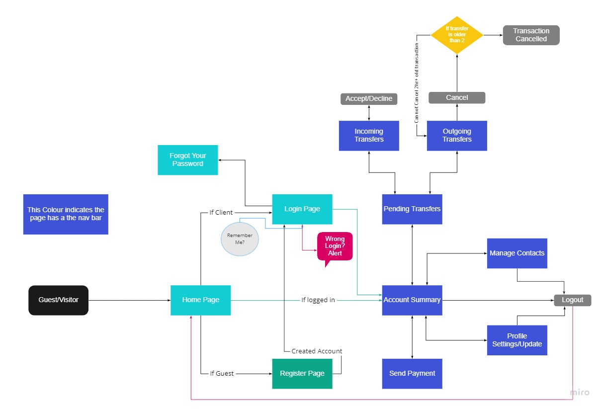
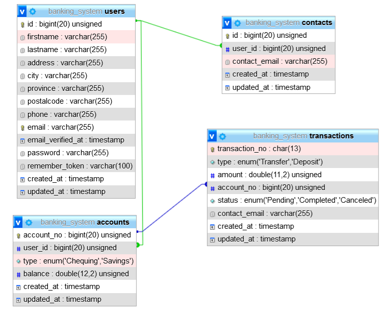

# Banking-System-Laravel

Banking Web app allowing user authentification and money transfers between user accounts.

Developed with PHP's framwork Laravel, Blade, Bootstrap, HTML and CSS.

1. # **INTRODUCTION**
   1. ## **PURPOSE OF THE PRODUCT DESIGN SPECIFICATION DOCUMENT**
The FAYM Bank Delivery document documents and tracks the necessary information required to effectively define architecture and system design to give the development team guidance on architecture of the system to be developed. The FAYM Bank Delivery document is created during the tying together of the front and back ends of the first iteration of the FAYM Bank system. Its intended audience is the project manager, project team, and development team of the active FAYM Bank system.
1. # **GENERAL OVERVIEW AND DESIGN GUIDELINES/APPROACH**
This section describes the principles and strategies to be used as guidelines when designing and implementing the system.
1. ## **ASSUMPTIONS / CONSTRAINTS / STANDARDS**
Resources:

- Bank staff will be available to test and learn the system during agreed upon times before opening system to clients
- Conference rooms/Presentation spaces will be available at the bank as required

Delivery:

- Bank servers arrive configured as expected
- Secondary servers arrive configured for regular backups of database

Budget:

- Project costs will stay the same as initially budgeted
- Initial training will be conducted on-site at bank with no additional costs

Finances:

- Funding for domains, database hosting, and software licensing will be provided by bank coordinators

Scope:

- Project scope is not subject to change following sign-off of bank coordinators on scope statement

Schedule:

- Materials will arrive within project schedule
- Training contracts will be completed within two weeks of commencing

Methodology:

- Project will follow agile methodology throughout execution
- Project will follow team governance guidelines and requirements

Technology:

- FAYM Bank System will be written and executed in PHP
- FAYM Bank System will use Laravel PHP Framework
- FAYM Bank System database storage will be facilitated with database hosting services
1. # **ARCHITECTURE DESIGN**
   - The FAYM Bank System will utilize REST API architecture
   1. ## ` `**LOGICAL VIEW**
   - Logical views can be found in Views folder\*
   1. ## ` `**HARDWARE ARCHITECTURE**
   - The FAYM Bank System will run on-site with emergency action capabilities to shut down or make changes
   - The FAYM Bank System database will reside in an offsite cloud, with regular onsite backups
   1. ## ` `**SOFTWARE ARCHITECTURE**
   - The FAYM Bank System database will be modelled as seen in [ER_Diagram.png](ER_Diagram.png)
   - Tables will be created using scripts in Migrations folder\*
   1. ## ` `**SECURITY ARCHITECTURE**
   - The FAYM Bank System employs Laravel PHP Framework for guaranteeing secure client authentications while moving from page to page as well as ensuring database security
   1. ## ` `**COMMUNICATION ARCHITECTURE**
   - The FAYM Bank System employs Laravel PHP Framework for communication between onsite server and offsite cloud database
1. # **SYSTEM DESIGN**
   1. ## ` `**USE-CASES**
   - Application use cases and scenarios:
   
   
   
   1. ## ` `**DATABASE DESIGN**
   - Database design will be implemented as specified in the ER diagram:
   
   
   
   - Database tables will be created using migration scripts in Migration folder\*
   1. ## ` `**APPLICATION PROGRAM INTERFACES**

1. ## **USER INTERFACE DESIGN**
- User Interface Design will be controlled by blade.php scripts that can be located inside the Views folder\*
1. # **PRODUCT DESIGN SPECIFICATION APPROVAL**
The undersigned acknowledge they have reviewed the **FAYM Bank Project Specification** document and agree with the approach it presents. Any changes to this Requirements Definition will be coordinated with and approved by the undersigned or their designated representatives.

# **Appendix A: References**

Views folder -> Delivery\BankingPHP\resources\views

Migrations folder -> Delivery\BankingPHP\database\migrations

Use\_Cases.pdf -> Delivery\Use\_Cases.pdf

